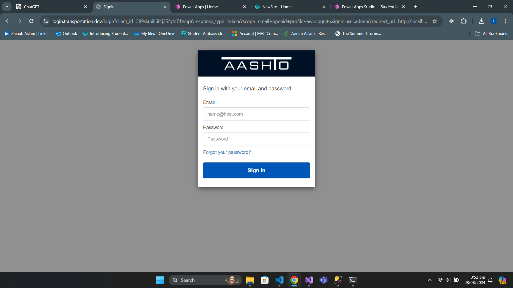
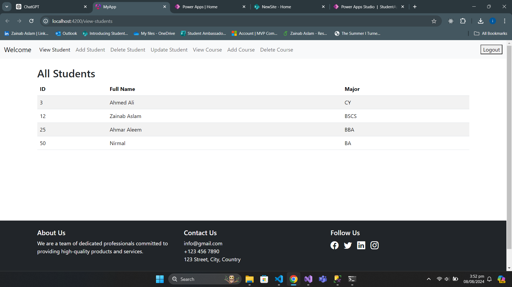
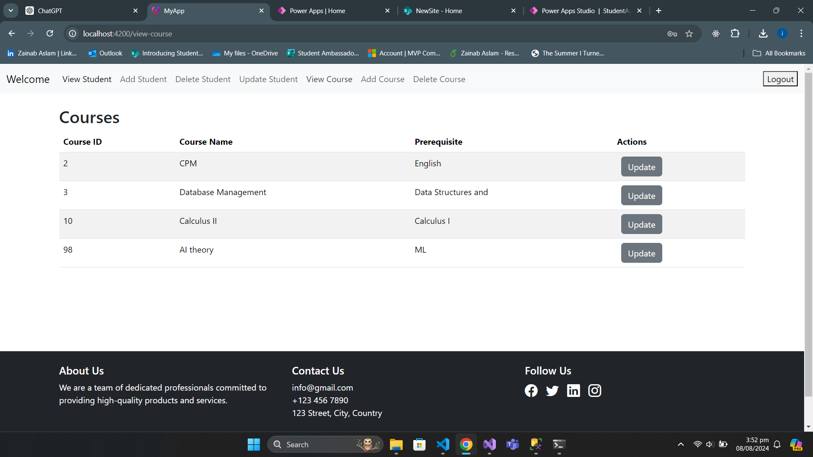
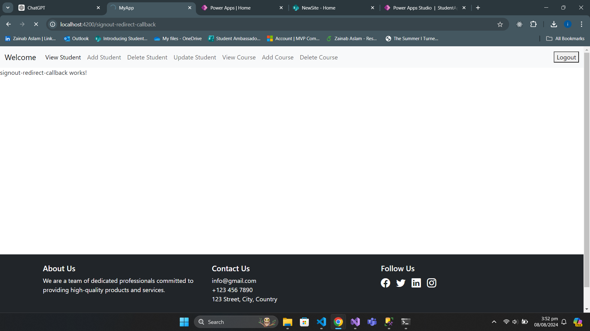

# Angular Student and Course CRUD App

## Overview

This Angular project demonstrates a basic application for managing students and courses with CRUD (Create, Read, Update, Delete) operations. The backend is handled by a .NET API, and the application includes user authentication using AWS Cognito.

## Features

- **Student and Course Management:** Perform CRUD operations for students and courses.
- **Authentication:** AWS Cognito is used for user authentication and token management.
- **Environment Variables:** Configured for secure and scalable operation.

## Setup

### Prerequisites

- [Node.js](https://nodejs.org/) (for running the Angular CLI)
- [.NET 8 SDK](https://dotnet.microsoft.com/download/dotnet/8.0) (for the backend)
- [AWS Cognito](https://aws.amazon.com/cognito/) (for authentication)

### 1. Clone the Repository

```bash
git clone <repository-url>
cd <repository-folder>
`````

### 2. Install Dependencies
```bash
npm install
````

### 3. Set Up Environment Variables
  - Create a .env file in the root directory and add your environment variables. For example:
    ```bash
    REACT_APP_API_URL=http://localhost:5000/api
    REACT_APP_AWS_COGNITO_CLIENT_ID=your-client-id
    REACT_APP_AWS_COGNITO_DOMAIN=your-cognito-domain
    REACT_APP_AWS_REDIRECT_URI=http://localhost:4200/signin-redirect-callback
    ```
  - For example my enviornment file looks like:
    ```bash
      export const environment = {
      production: true,
      apiUrl: 'https://localhost:7162/api' ,
      clientID: '389siapill6f4j35fqfn71tvbp', 
      Client_Secret: '3ckvr9c08g1ue0a7ro1spdnhh1ddm2q3o00pq4s0i4quqr6vge0', 
      redirectSignIn: 'http://localhost:4200/signin-redirect-callback', 
      Cognito_Base_Url: 'https://login.transportation.dev',
      redirectSignOut: "http://localhost:4200/signout-redirect-callback",
      Scope: "email+openid+profile+aws.cognito.signin.user.admin",
    };
  ``
### 4. Configure Authentication
AWS Cognito handles user authentication. Upon successful login, users are redirected to the view students component.  
  

### 5. Run the application
  ```bash
    ng serve
  ````
Visit http://localhost:4200 to view the application. 


  

  


### 6. Authentication Flow
1. Login: Users are directed to the AWS Cognito login page.
2. Token Management: On successful login, tokens are stored and used for subsequent API requests.
3. Redirection: After login, users are redirected to the view students component.  


  

### 7. Backend API
The backend API is built using .NET and handles CRUD operations for students and courses. Ensure that the API is running and accessible.  
To access my backend api code follow this link [Backend API](https://nodejs.org/)

## And you are good to go :)
